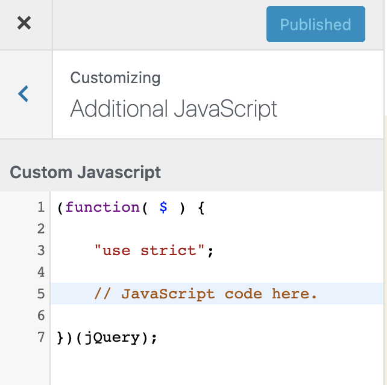

# Additional JavaScript for WordPress Customizer

## About

**Additional JavaScript for WordPress Customizer** lets you add JavaScript code, to the front-end, using the WordPress Customizer - safely and with live preview.

## Features

- Add custom JavaScript through the familiar WordPress Customizer interface
- Live preview of JavaScript changes
- Syntax highlighting in the editor
- Error reporting for JavaScript syntax issues
- Revision history for your JavaScript code (uses WordPress post revisions)
- Secure implementation - only users with the 'unfiltered_html' capability can edit JavaScript
- Clean, minimal interface focused on code editing
- Works with any WordPress theme

## Security

This plugin restricts JavaScript editing to users with the 'unfiltered_html' capability, which by default is only granted to administrators on single site installations and super administrators on multisite installations.

## Installation

You know the drill.

- [Download the plugin](https://github.com/soderlind/additional-javascript/archive/master.zip)
- Go to Plugins > Add New.
- Click on Upload Plugin button found on top left corner of page
- Select the downloaded .zip file

Or add the plugin to your composer file using `composer require "soderlind/additional-javascript"`

## Usage

1. Navigate to Appearance → Customize in your WordPress admin area
2. Click on the "Additional JavaScript" section at the bottom of the customizer menu
3. Add your JavaScript code in the editor
4. See the live preview of your changes
5. Click "Publish" to apply your JavaScript to the site

## Requirements

- WordPress 6.3 or higher
- PHP 8.2 or higher
- User with `unfiltered_html` capability

## Frequently Asked Questions

### Who can add JavaScript using this plugin?

Only users with the 'unfiltered_html' capability can add JavaScript using this plugin. By default, this is limited to administrators on single site installations and super administrators on multisite installations.

### Will this slow down my site?

No, the plugin is designed to be lightweight and only loads the necessary scripts and styles when needed.

### Where is the JavaScript added on my site?

The JavaScript is added at the end of the `<head>` section of your site with a priority of 110.

## Changelog

### 1.1.0
- Updated compatibility with WordPress 6.5
- Code improvements and optimization
- Enhanced security measures

### 1.0.0
- Initial release

# Copyright and License

Additional JavaScript is copyright 2018-2025 Per Soderlind

Additional JavaScript is free software: you can redistribute it and/or modify it under the terms of the GNU General Public License as published by the Free Software Foundation, either version 2 of the License, or (at your option) any later version.

Additional JavaScript is distributed in the hope that it will be useful, but WITHOUT ANY WARRANTY; without even the implied warranty of MERCHANTABILITY or FITNESS FOR A PARTICULAR PURPOSE. See the GNU General Public License for more details.

You should have received a copy of the GNU Lesser General Public License along with the Extension. If not, see http://www.gnu.org/licenses/.
